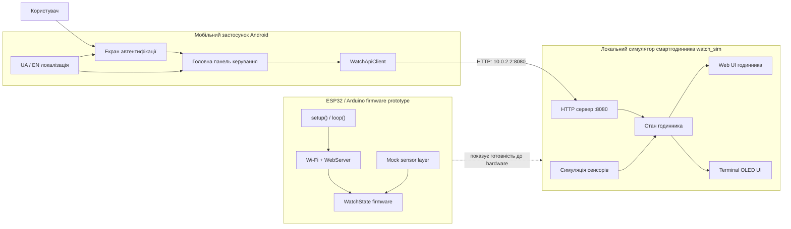
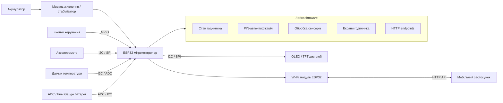
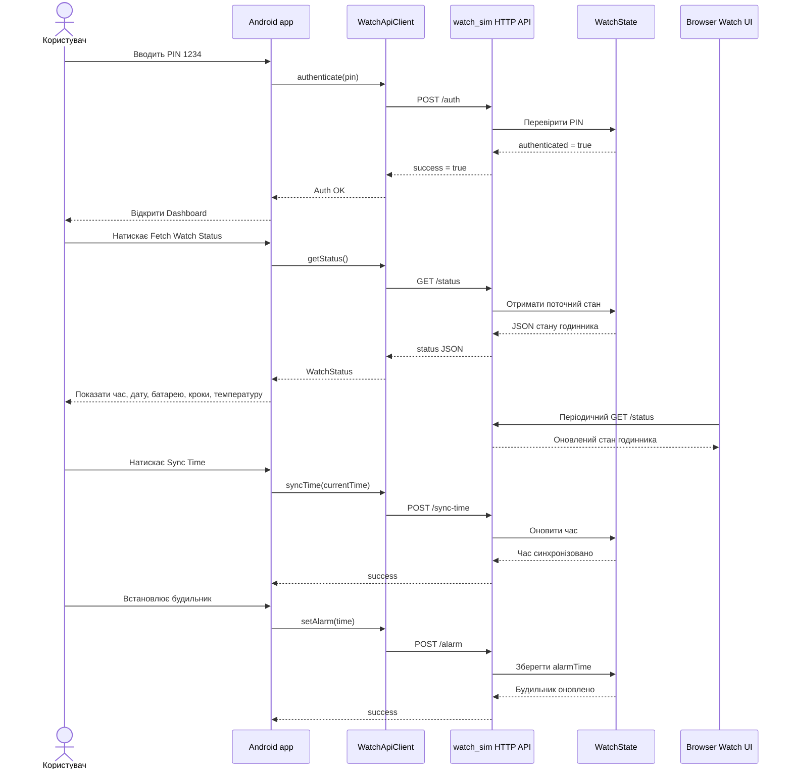
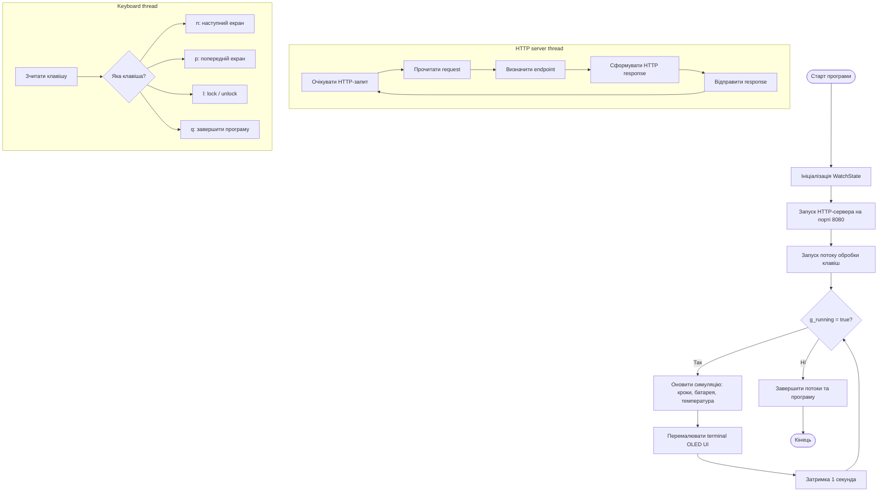
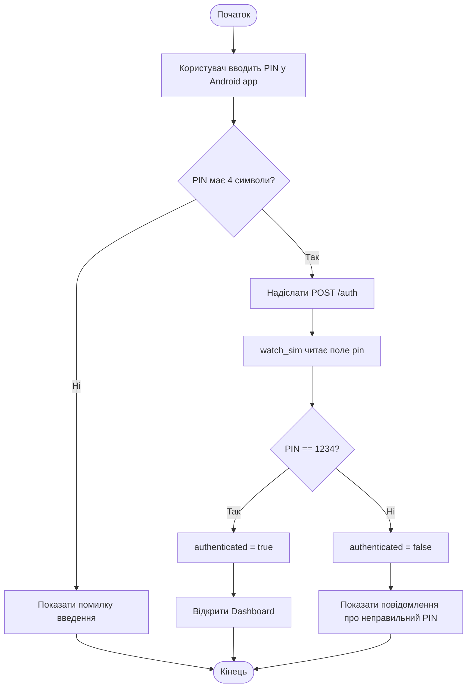
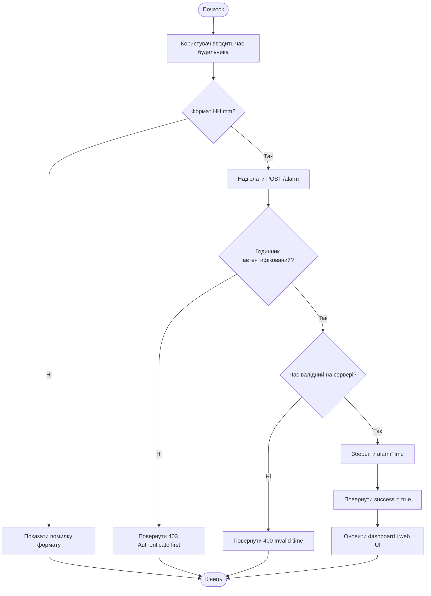

# Графічні матеріали до дипломного проєкту

Цей документ містить набір схем для дипломного проєкту "Інтелектуальна система смартгодинника з автентифікацією користувача через мобільний застосунок".

Схеми побудовані за фактичною архітектурою проєкту:

- `watch_sim/` - локальний симулятор смартгодинника;
- `android_app/` - мобільний застосунок Android;
- `watch_firmware_arduino/` - ESP32/Arduino firmware-версія;
- HTTP API - локальний канал взаємодії між застосунком і годинником;
- browser UI - візуальна заміна OLED-дисплея для демонстрації без фізичного пристрою.

## 1. Структурна схема системи

Структурна схема показує основні частини системи та зв'язки між ними.

Коротке пояснення:

- Користувач взаємодіє з Android-застосунком.
- Android-застосунок відправляє HTTP-запити до локального симулятора годинника.
- `watch_sim` зберігає стан пристрою, обробляє API та показує web UI годинника.
- Arduino firmware є окремою ESP32-версією логіки для демонстрації готовності до перенесення на фізичний пристрій.

## 2. Функціональна схема системи

Функціональна схема показує, які функції виконує кожен компонент системи.

```mermaid
flowchart TB
    System["Система смартгодинника з мобільною автентифікацією"]

    System --> Auth["Автентифікація користувача"]
    System --> Status["Моніторинг стану годинника"]
    System --> Control["Керування годинником"]
    System --> Display["Відображення даних"]
    System --> Simulation["Симуляція фізичних даних"]
    System --> Localization["Локалізація інтерфейсу"]

    Auth --> PinInput["Введення PIN у мобільному застосунку"]
    Auth --> PinCheck["Перевірка PIN на стороні годинника"]
    Auth --> LockState["Стан: заблоковано / розблоковано"]

    Status --> TimeStatus["Поточний час"]
    Status --> DateStatus["Дата і день тижня"]
    Status --> BatteryStatus["Рівень батареї"]
    Status --> StepsStatus["Кількість кроків"]
    Status --> TemperatureStatus["Температура"]
    Status --> AlarmStatus["Час будильника"]

    Control --> SyncTime["Синхронізація часу"]
    Control --> SetAlarm["Встановлення будильника"]
    Control --> LockWatch["Блокування годинника"]
    Control --> ChangeScreen["Перемикання екранів годинника"]

    Display --> MobileDashboard["Dashboard в Android app"]
    Display --> BrowserWatch["Browser UI годинника"]
    Display --> SerialTerminal["Terminal / Serial Monitor UI"]

    Simulation --> StepMock["Mock-генерація кроків"]
    Simulation --> BatteryMock["Mock-розряд батареї"]
    Simulation --> TempMock["Mock-зміна температури"]

    Localization --> Ukrainian["Українська мова"]
    Localization --> English["Англійська мова"]
```

Коротке пояснення:

- Система виконує не одну дію, а набір пов'язаних функцій: автентифікацію, моніторинг, керування, відображення та симуляцію даних.
- Основні дії керування доступні лише після успішної автентифікації.
- Симуляція сенсорів замінює фізичні датчики на етапі програмного прототипу.

## 3. Принципова схема пристрою

Принципова схема показує, як виглядала б апаратна частина смартгодинника при перенесенні прототипу на реальний ESP32-пристрій.

Коротке пояснення:

- У поточному дипломному прототипі реальні сенсори замінені програмною симуляцією.
- У фізичній версії ESP32 отримував би дані від акселерометра, температурного датчика та модуля контролю батареї.
- OLED/TFT-дисплей замінився browser UI у локальній демонстрації.

## 4. Діаграма процесів системи

Діаграма процесів показує типовий сценарій взаємодії користувача, Android-застосунку та годинника.

Коротке пояснення:

- Центральний процес починається з PIN-автентифікації.
- Після автентифікації мобільний застосунок отримує право змінювати час і будильник.
- Browser UI не є окремим backend-ом, він лише відображає той самий стан, що й Android-застосунок.

## 5. Блок-схема алгоритму роботи основної програми

Ця блок-схема описує загальний алгоритм роботи `watch_sim`.

Коротке пояснення:

- Основна програма працює циклічно.
- Окремий потік обробляє HTTP-запити.
- Окремий потік обробляє клавіатурне керування.
- Основний цикл відповідає за симуляцію стану та вивід terminal UI.

## 6. Блок-схеми алгоритмів роботи функцій

У цьому розділі наведено дві функціональні блок-схеми: автентифікація та встановлення будильника.

### 6.1 Блок-схема алгоритму автентифікації користувача

Пояснення:

- Android-застосунок перевіряє тільки базову коректність введення.
- Остаточне рішення про автентифікацію приймає сторона годинника.
- Якщо PIN правильний, відкривається головний екран застосунку.

### 6.2 Блок-схема алгоритму встановлення будильника

Пояснення:

- Встановлення будильника є захищеною дією.
- Якщо користувач не автентифікований, сервер не дозволяє змінювати `alarmTime`.
- Після успіху Android dashboard і browser UI показують оновлений стан.

## Як використовувати ці схеми

Ці схеми можна:

- залишити в Markdown-документації;
- відкрити на GitHub, де Mermaid-діаграми будуть відрендерені автоматично;
- експортувати у зображення або PDF;
- перенести в пояснювальну записку як графічні матеріали.

Для захисту найкраще використовувати:

- структурну схему для пояснення архітектури;
- функціональну схему для пояснення можливостей системи;
- принципову схему для пояснення майбутнього hardware-пристрою;
- діаграму процесів для демонстрації сценарію роботи;
- блок-схеми алгоритмів для пояснення програмної логіки.
